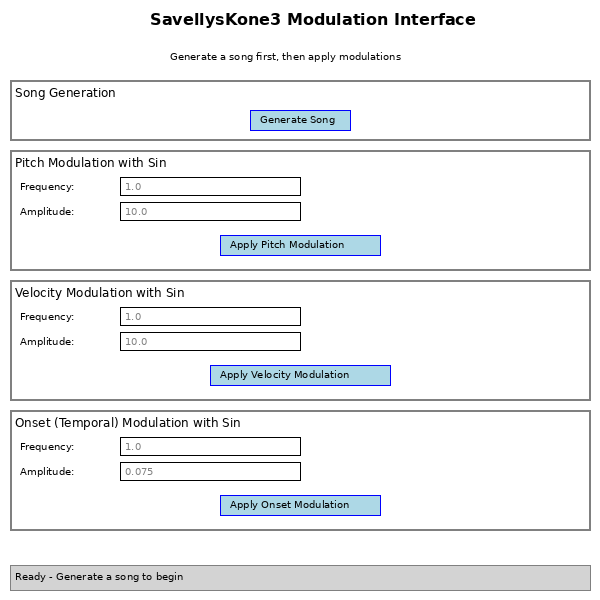

# SavellysKone3 Modulation GUI

A graphical user interface for applying sinusoidal modulation effects to MIDI compositions generated with savellysKone3.



## Features

This GUI provides an intuitive interface to:

1. **Generate MIDI songs** - Create basic songs using grammar-based generation
2. **Apply Pitch Modulation** - Modulate note pitches using sine waves
3. **Apply Velocity Modulation** - Modulate note velocities (dynamics) using sine waves  
4. **Apply Onset Modulation** - Modulate note timing (temporal effects) using sine waves
5. **Export to MIDI** - Save modulated compositions as MIDI files

## Usage

### Running the GUI

```bash
python3 savellysKone3_gui.py
```

### Workflow

1. **Generate a Song**: Click the "Generate Song" button to create a basic song with default parameters
2. **Apply Modulations**: Adjust frequency and amplitude values for each modulation type, then click the corresponding "Apply" button
3. **Experiment**: Try different combinations of modulations
4. **Export**: Click "Save MIDI File" to export your modulated composition

### Modulation Parameters

Each modulation type accepts two parameters:

- **Frequency (freq)**: Controls the rate of oscillation in the sine wave
  - Higher values = faster modulation
  - Typical range: 0.1 to 5.0
  
- **Amplitude (amp)**: Controls the intensity of the modulation
  - Higher values = more dramatic effect
  - Pitch amplitude: typically 1-20 (semitones)
  - Velocity amplitude: typically 1-50 (MIDI velocity units)
  - Onset amplitude: typically 0.01-0.2 (seconds)

### Modulation Types

#### Pitch Modulation
- Adds sinusoidal variation to note pitches
- Creates pitch wobble or vibrato-like effects
- Default: freq=1.0, amp=10.0

#### Velocity Modulation
- Adds sinusoidal variation to note velocities
- Creates dynamic swells and fades
- Default: freq=1.0, amp=10.0

#### Onset (Temporal) Modulation
- Adds sinusoidal variation to note timings
- Creates rhythmic variations and groove
- Default: freq=1.0, amp=0.075

## Requirements

- Python 3.x
- tkinter (usually included with Python)
- midiutil: `pip install midiutil`

## Example Experimentation

Try these parameter combinations:

**Subtle Vibrato**
- Pitch: freq=2.0, amp=2.0

**Dramatic Pitch Sweep**
- Pitch: freq=0.5, amp=15.0

**Dynamics Swell**
- Velocity: freq=0.3, amp=30.0

**Rhythmic Groove**
- Onset: freq=1.5, amp=0.1

**Combined Effect**
Apply multiple modulations in sequence for complex, evolving textures!

## Notes

- Modulations are applied cumulatively - you can apply the same or different modulations multiple times
- To start fresh, click "Generate Song" again
- The GUI uses simple default grammars for song generation; for more complex compositions, use savellysKone3.py directly

## Related Files

- `savellysKone3.py` - Core library with Song class and modulation methods
- `sk3Test_modulators.py` - Example script showing modulation usage
