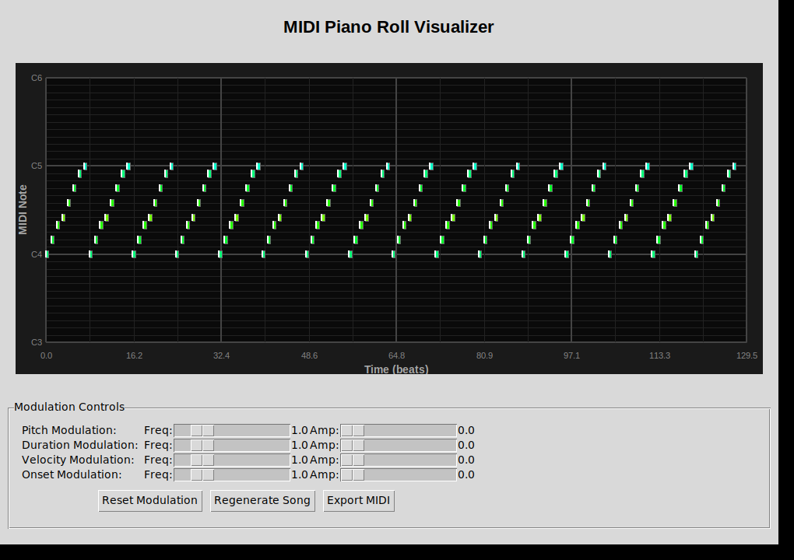
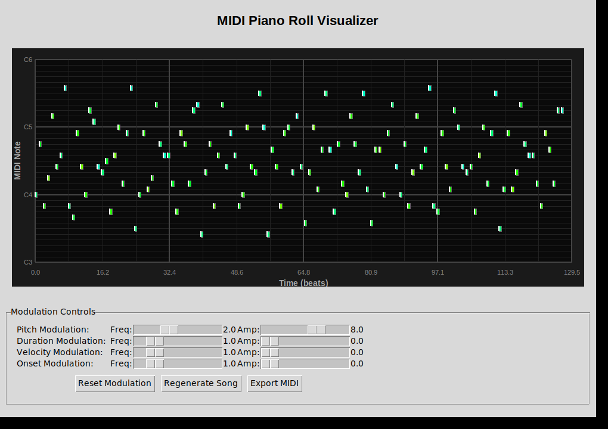
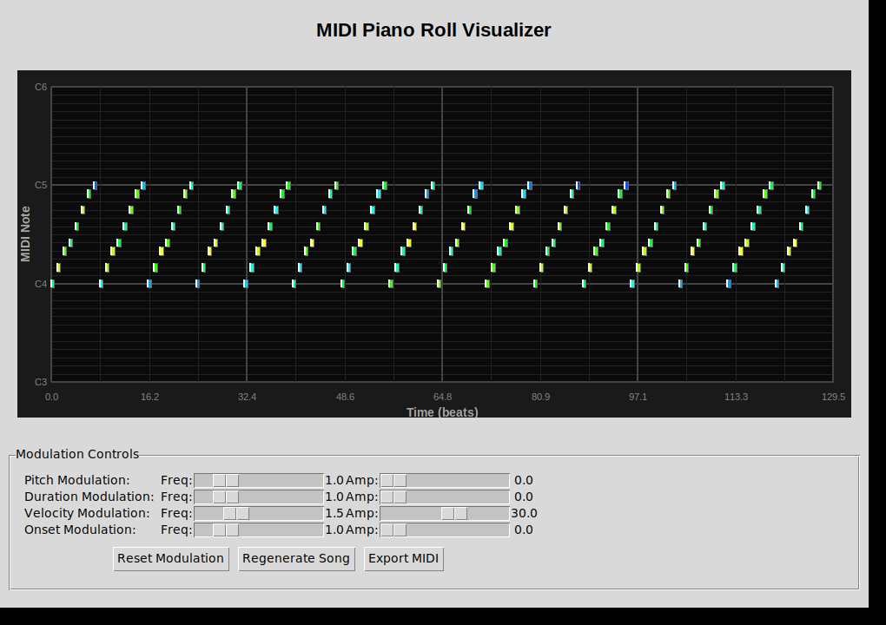
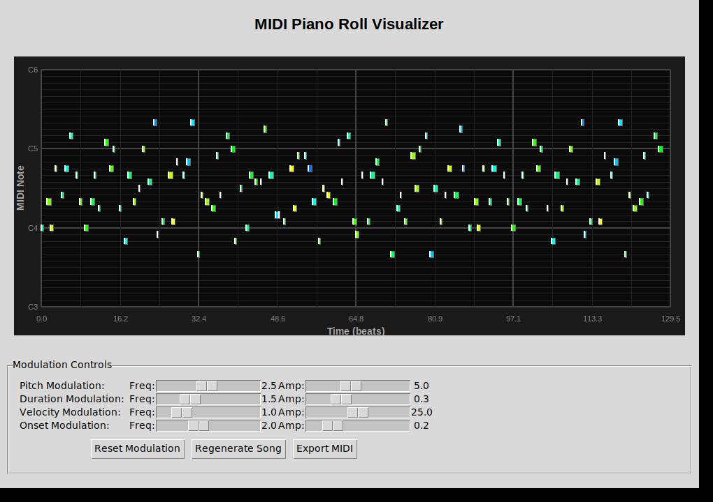

# Piano Roll Display for savellysKone

This enhancement adds a visual Piano Roll Display GUI to the savellysKone MIDI generation toolkit.

## Features

The `PianoRollDisplay` class provides:

1. **2D Grid Visualization**
   - X-axis: Time (beats)
   - Y-axis: MIDI note numbers (48-84 by default, C3 to C6)
   - Clear grid lines with highlighted C notes
   - Axis labels for easy reading

2. **Note Visualization**
   - Notes displayed as colored rectangles
   - Color gradient represents velocity (blue = low, yellow = high)
   - White edge on left side indicates note-on events
   - Duration clearly visible as rectangle width

3. **Real-time Updates**
   - Automatically refreshes when MIDI data changes
   - Reflects modulation parameter changes instantly
   - Interactive sliders for modulation control

4. **Modulation Controls**
   - **Pitch Modulation**: Sine wave modulation of note pitches
   - **Duration Modulation**: Modulation of note durations
   - **Velocity Modulation**: Modulation of note velocities (affects color)
   - **Onset Modulation**: Modulation of note timing

## Usage

### Running the GUI

```bash
python3 piano_roll_gui.py
```

Or use the demo script:

```bash
python3 demo_piano_roll.py
```

### Using PianoRollDisplay in Your Code

```python
import tkinter as tk
from piano_roll_gui import PianoRollDisplay
import savellysKone3 as sk3

# Create a window
root = tk.Tk()

# Create the piano roll display
piano_roll = PianoRollDisplay(root, width=800, height=400)
piano_roll.pack()

# Create and set a song
song = sk3.Song(...)
song.make_bar_list()
piano_roll.set_song(song)

root.mainloop()
```

### GUI Controls

- **Frequency Sliders**: Control the frequency of the sine wave modulation (0.1 to 5.0 Hz)
- **Amplitude Sliders**: Control the intensity of the modulation effect
- **Reset Modulation**: Clear all modulation effects and return to original pattern
- **Regenerate Song**: Generate a new random MIDI pattern
- **Export MIDI**: Save the current pattern with modulations to a MIDI file

## Visual Examples

### Baseline (No Modulation)


### Pitch Modulation


### Velocity Modulation


### Combined Modulation


## Files

- `piano_roll_gui.py` - Main GUI implementation with PianoRollDisplay class
- `demo_piano_roll.py` - Demo script showcasing the GUI
- `test_piano_roll_gui.py` - Test script for automated testing
- `create_visual_demos.py` - Script to generate example screenshots

## Implementation Details

### PianoRollDisplay Class

The `PianoRollDisplay` class extends `tkinter.Canvas` and provides:

- **Grid Drawing**: Draws a grid with time and note axes
- **Note Rendering**: Converts MIDI note data to visual rectangles
- **Color Mapping**: Maps velocity values to color gradients
- **Coordinate Conversion**: Transforms MIDI data to screen coordinates
- **Auto-refresh**: Updates display when song data changes

### Integration with savellysKone3

The GUI integrates seamlessly with the existing `savellysKone3` module:

- Uses `Song`, `Bar`, and `Note` classes
- Supports all modulation methods:
  - `modulate_pitch_with_sin()`
  - `modulate_duration_with_sin()`
  - `modulate_velocity_with_sin()`
  - `modulate_onset_with_sin()`

## Requirements

- Python 3.x
- tkinter (python3-tk)
- midiutil
- musical-scales
- PIL (Pillow) - optional, for screenshots

Install dependencies:
```bash
pip install midiutil musical-scales pillow
sudo apt-get install python3-tk  # On Ubuntu/Debian
```

## Design Decisions

1. **Color Scheme**: Dark background (#1a1a1a) with colored notes for better visibility
2. **Velocity Mapping**: Blue to yellow gradient provides intuitive visual feedback
3. **Note-on Indication**: White edge on left side clearly marks note start
4. **Grid Lines**: C notes highlighted for musical context
5. **Real-time Updates**: Immediate feedback when modulation parameters change

## Future Enhancements

Potential improvements:
- Multiple track support
- Zoom controls for time/pitch axes
- Note editing capabilities
- Playback integration
- MIDI file import
- Customizable color schemes
